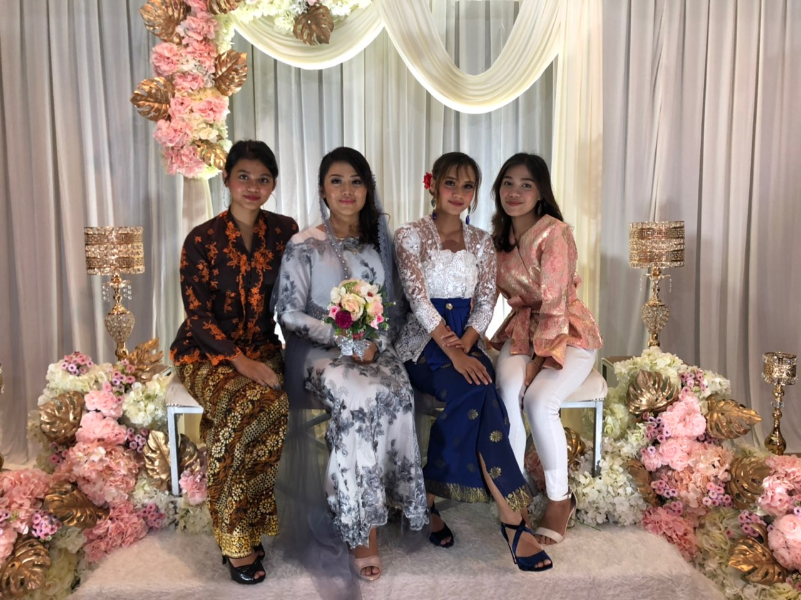
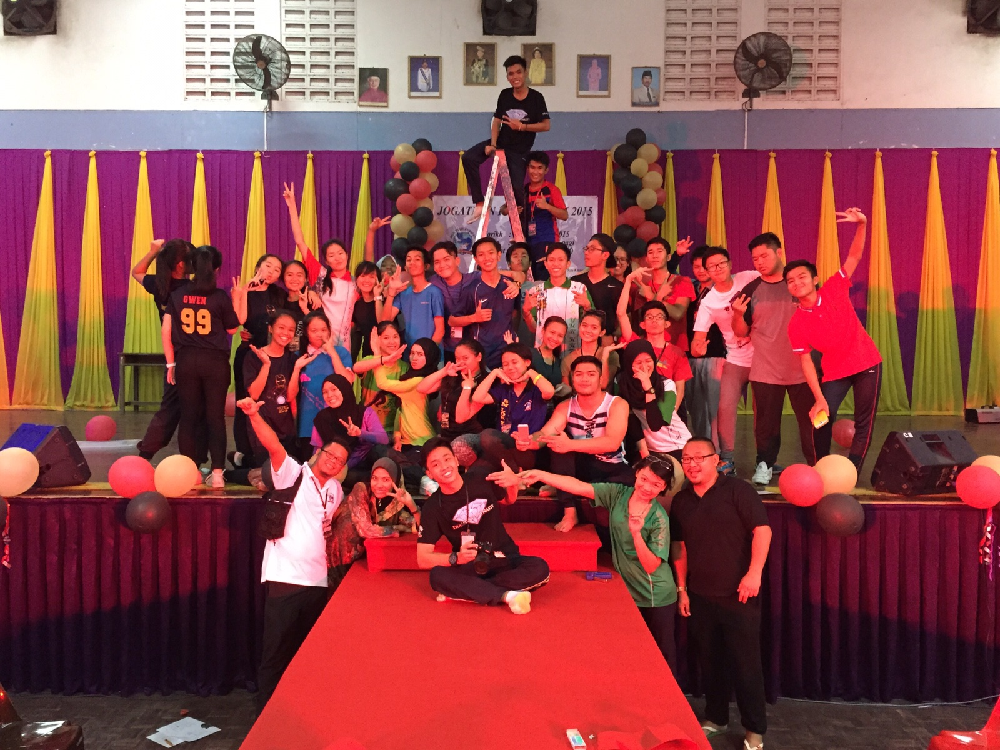
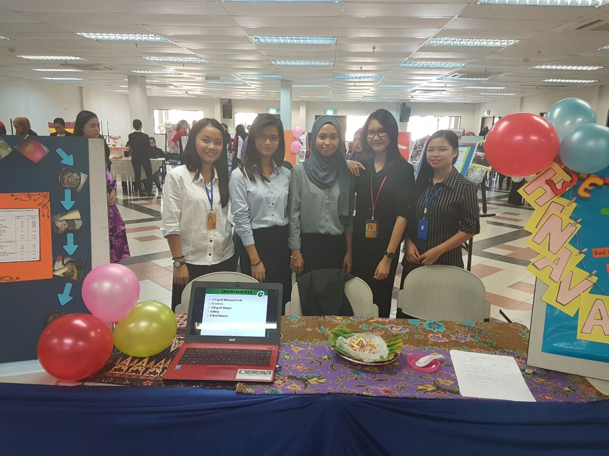
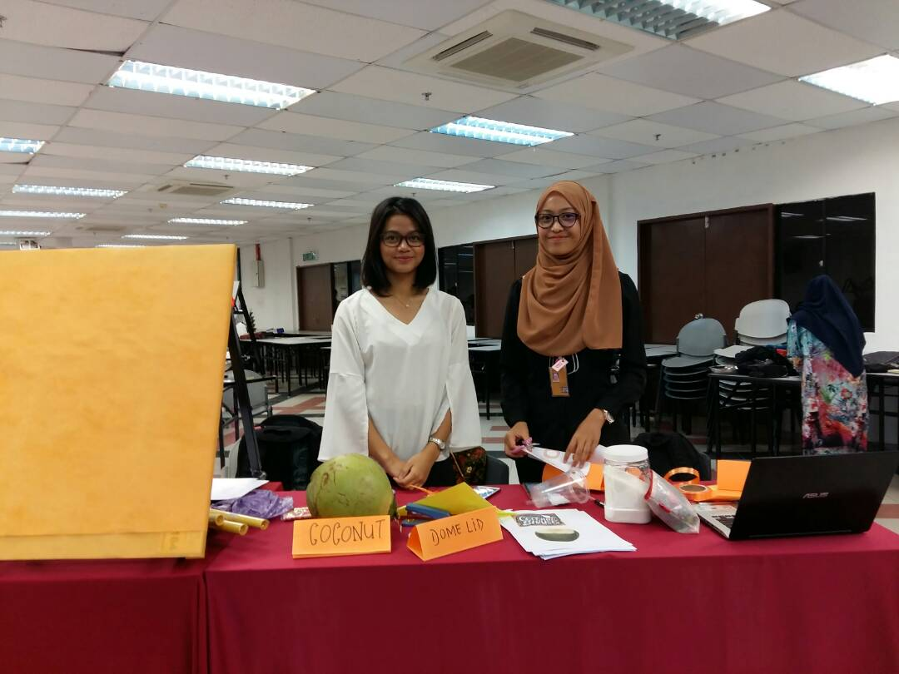
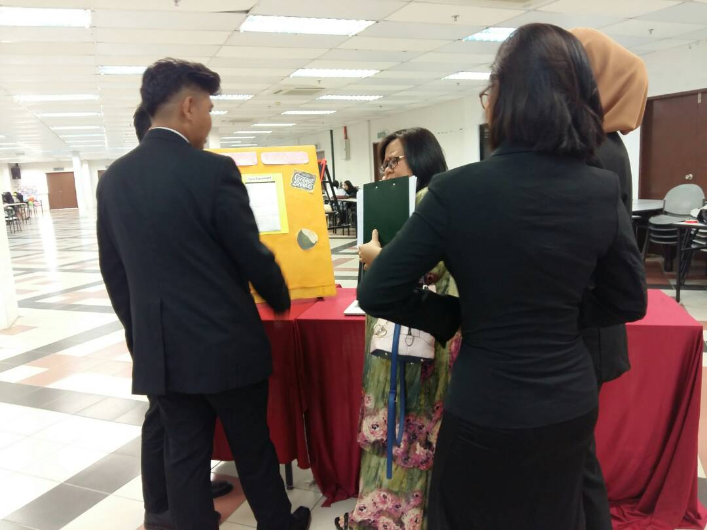
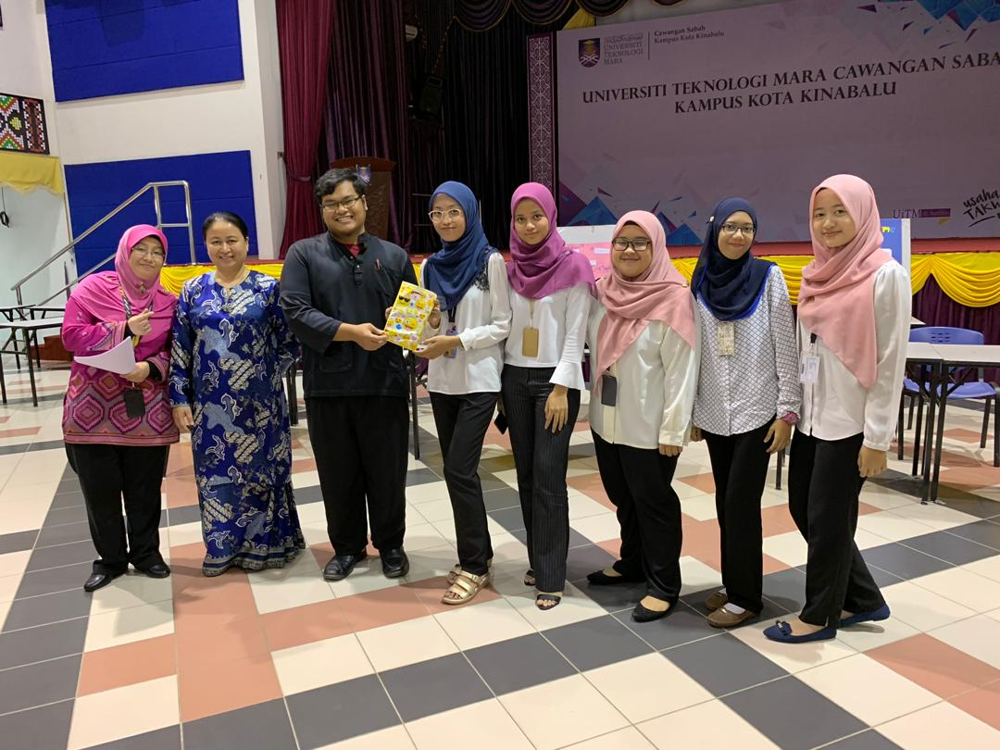

<!DOCTYPE html>
<hhtml>
<head>
<title>RESUME</title>
</head>
<body style="background-color:grey;">

<h1 style="text-align:center;">RESUME</h1>

<h4 style="text-align:center; font-size:20px;" >PROFILE</h4>

<b><i>Hello, am looking for a job, to add more experience in this field especially in planning meeting and event. Since i have few experience in creating and handling event in my previous job.
I am very interested with this kind of job but i also can work in accounting management. 
My educational background start with Diploma in Accounting at University Technology MARA for 3 years and I change my course to Bachelor in Office System Management also in UiTM.
Even when I study, I am an active student especially planning and managing event in campus.
I really looking forward to work with any company that are looking for an employee with this criteria.</b></i>

<h4 style="text-align:center; font-size:30px; color:blue;">SKILLS</h4>

&#8594;OFFICE MANAGEMENT

&#8594;MEETING AND PLANNING EVENT

&#8594;CUSTOMER RELATIONS & COMMUNICATION

&#8594;FNANCIAL REPORTING

&#8594;PROJECT MANAGER

<h4 style="text-align:center; font-size:30px; color:blue;">EDUCATION</h4>

&#8594;DIPLOMA IN ACCOUNTING

<i>University Technology MARA</i>

-BACHELOR IN OFFICE SYSTEMS MANAGEMENT(HONS)

<i>University Technology MARA</i>

<h4 style="text-align:center; font-size:30px; color:blue;">WORKING EXPERIENCE</h4>

&#8594;Work as a produciton manager in a private company for 18 months

&#8594;Work as a event planner in a wedding boutique for a year

&#8594;Work in accounting firm as an accountant for 6 months

<h4 style="text-align:center; font-size:30px; color:blue;">MY ACTIVITY</h4>

</body>
</html>
